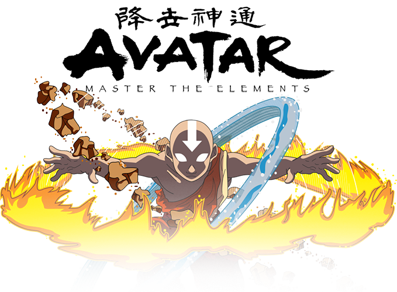

# Avatar - Master The Elements

The time has come for Aang to master the elements and enter the "Avatar State". The fate of the world falls heavily on his shoulders. Help Aang defeat Fire Lord Ozai by combining the powers of water, earth, fire, and air. Be warned, however, the elements' powers are not to be taken lightly. Achieve the Avatar State and bring peace to the nations.

### How to Play

A modern web browser is recommeded for playing this game. Thanks to Bootstrap, this game is fully responsive and playable on mobile devices.

#### Rules

A random number, called the "Power Level Needed" ,highlighted in red, will be generated at the start of each game.

There are four element symbols in the middle of the game page. Each symbol is given a random value that is hidden. By clicking on each symbol, the hidden value will be added to the "Current Power Level".

Achieve the Avatar State and save the world by matching the current power level to the power level needed. If the current power level exceeds the power level needed, Aang will be overwhelm and the world will fall into chaos. The balance of the world hinges on your hands.

Good Luck!

To play the game again, click on Aang's to reset the power levels.

## Play the Game
Launch the game here! [Avatar - Master the Elements](https://jimmytutron.github.io/AvatarMasterTheElements/) 

## Built With

* [Javascript](https://www.javascript.com/) - programming language
* [jQuery](https://jquery.com/) - a javascript library
* [Bootstrap](https://getbootstrap.com/) - The web framework used

## Authors

* **Jimmy Tu** - [jimmytutron](https://github.com/jimmytutron)

## Acknowledgments

Thanks to the following people for their open source css libraries. Helped add a little *_pizzaz_* to my game.

* [Animate.css](https://daneden.github.io/animate.css/) - [Daniel Eden](https://daneden.me/)
* [Hover.css](http://ianlunn.github.io/Hover/) - [Ian Lunn](https://github.com/IanLunn)

And huge thanks and admiration to the creators of Avatar, for making such a wonderfully deep and engaging series. ~where's that new avatar series doe~
